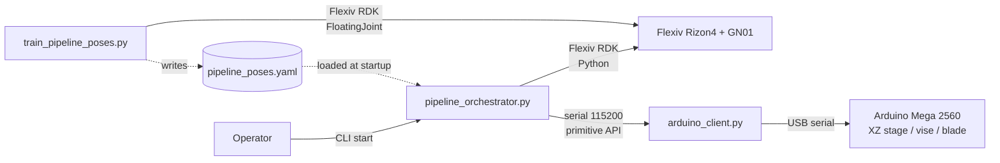
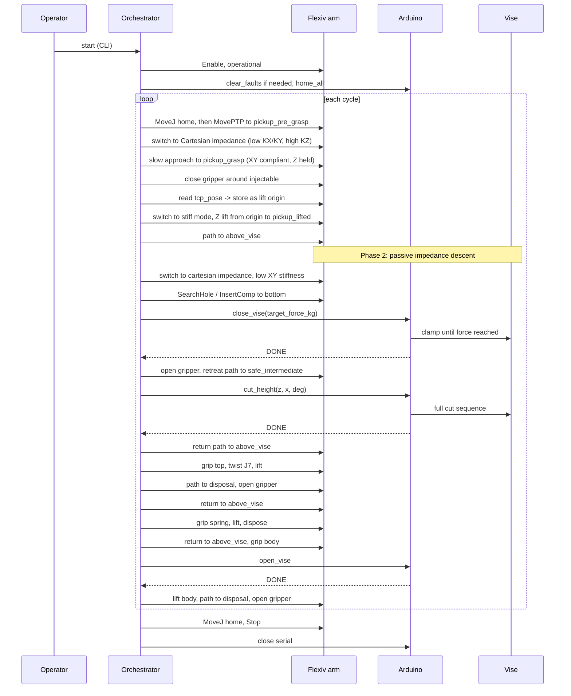
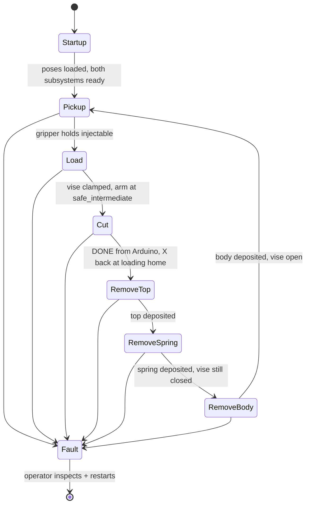

# Architecture

## High-level system



The orchestrator owns time-ordered control. The robot client is a thin convenience layer
on top of the Flexiv RDK; the Arduino client wraps the line-based serial protocol from
`PRIMITIVES.md`. A separate trainer captures poses and writes them to a YAML file that
the orchestrator reads at startup.

## Components

### `pipeline_orchestrator.py`

Single-process Python script. Owns:

- The PARAMS block (single source of tunable values).
- The state machine for the six pipeline phases plus fault and shutdown.
- The pose file loader (validates schema and required entries).
- Coordination across the robot and the Arduino, including the rule that the robot must
  be at `safe_intermediate` while the Arduino is in cutting state.

### `arduino_client.py`

Module with class `ArduinoClient`. Speaks the line-based primitive API from
`XZ Stage Code v2/PRIMITIVES.md`:

- One mutating command at a time. Each call returns after the matching `DONE <cmd_id>` is
  received, or raises on `ERR` or timeout.
- Auto-incrementing `cmd_id` per instance.
- Query methods (`get_status`, `get_force`) return parsed dicts immediately.
- Reset path: `clear_faults` on startup if the firmware boots faulted.

### `flexiv_helpers.py`

Module with `RobotSession` context manager plus a handful of utility functions
(`execute_primitive`, `wait_for_primitive`, `selected_arm_state`, `switch_mode`,
`set_cartesian_impedance`, `read_external_wrench`). Factors out the boilerplate currently
duplicated across `record_robot_waypoints.py`, `play_recorded_waypoints.py`, and
`movej_joint_10deg.py`. Existing scripts can be refactored to use this without changing
behavior (a milestone).

### `train_pipeline_poses.py`

Interactive pose recorder modeled on `record_robot_waypoints.py`. Differences:

- Driven by a hardcoded checklist of named poses and paths (not free-form names).
- Walks the operator through each entry in order; refuses to skip; supports re-capture.
- Captures both single poses and ordered waypoint sequences (paths) for obstacle
  avoidance.
- Writes a structured YAML file rather than JSONL.

### `pipeline_poses.yaml`

Single source of pose data, consumed by the orchestrator. See
`specifications.md` for the schema. Versioned via a top-level `schema_version` field.

## Data flow per cycle



## State machine



The orchestrator never auto-recovers from `Fault`. A fault stops the cycle, returns the
arm to `safe_intermediate` if possible, calls `STOP_ALL` on the Arduino, and exits.
Restarting requires operator review.

## Key design decisions

1. **Two-protocol orchestrator.** The Flexiv arm has its own native Python API; the
   Arduino has its own ASCII protocol. Each subsystem keeps its own client; the
   orchestrator coordinates. Rationale: bridging at the orchestrator keeps either half
   testable in isolation.

2. **Passive Cartesian impedance, not active force search, for pickup centering.**
   `NRT_CARTESIAN_MOTION_FORCE` (or the equivalent impedance mode in the installed RDK
   version — name verified at implementation time) with low XY stiffness gives the
   self-centering behavior the operator described, at a fraction of the code and tuning
   of an active force loop. Active search is left as a future optimization.

3. **Single PARAMS block.** Every tunable in `pipeline_orchestrator.py` lives at the top
   of the file in one block, with name, units, default, and a short rationale comment.
   Rationale: the operator tunes one place; no magic numbers scattered through phases.

4. **YAML for poses, not JSONL.** The trainer writes structured YAML keyed by pose name
   and path name. The existing `trajectory_waypoints*.txt` JSONL files stay as-is for
   their own playback script; the pipeline uses a different file with a different schema.
   Rationale: named lookups, comments, and per-component disposal-pose overrides are all
   first-class in YAML and awkward in JSONL.

5. **Block on `DONE`.** Every mutating Arduino command waits synchronously for `DONE`
   before the orchestrator advances. `GET_STATUS` polling during a move is not used in
   v1. Rationale: the firmware is request-response; status polling is only valuable if
   we want a UI progress indicator, which we do not.

6. **Multi-waypoint paths are first-class.** Between every pair of named poses where
   obstacle avoidance is needed, the operator records an ordered list of waypoints. The
   orchestrator walks each path with `MovePTP` blending. If no path is defined between
   two poses, the orchestrator does a direct `MovePTP` to the target. Rationale: the
   pipeline crosses the cutting-machine envelope and the operator already flagged this
   as a concern.

7. **Grip-then-release ordering for Phase 6.** The gripper closes on the body first,
   then the orchestrator commands `OPEN_VISE`, then the arm lifts. Rationale: if the
   vise opens first the body can drift; if the arm tries to lift against a closed vise
   it faults the arm. The grip-then-release order keeps the gripper in custody of the
   body through the handoff. An alternative "release-then-grip" flow plus a firmware
   change to release the vise past the force=0 threshold has been considered and is
   documented in `specifications.md` §1.4 Phase 6 as a future option if the default
   proves unreliable on real injectables.

8. **Capture post-compliance TCP as the Phase 1 lift origin.** After the compliant grip
   in Phase 1, the orchestrator reads `robot.states().tcp_pose` and stores that as the
   starting point for the vertical lift, rather than trusting the planned pre-grasp
   pose. Rationale: the compliance has by definition moved the wrist away from the
   nominal position; lifting from the actual position is what the operator wants. Same
   pattern is available in Phase 2 (after the impedance descent into the vise) if it
   proves useful.

## Failure handling

| Trigger | Detection | Handling |
| --- | --- | --- |
| Flexiv fault during motion | `robot.fault()` polled between primitive calls | Try `ClearFault`; if it succeeds, restart current phase; if not, abort |
| Arduino `ERR` response | parsed by `ArduinoClient` | Raise `ArduinoCommandError(code, message)`; orchestrator transitions to Fault |
| Arduino timeout (no `DONE`) | per-command timeout in `ArduinoClient` | Send `STOP_ALL`; transition to Fault |
| Force threshold exceeded during impedance descent | `ext_wrench_in_tcp` monitor | Retract Z, transition to Fault |
| Missing pose in YAML | pose loader validation at startup | Refuse to start; print which poses are missing |
| Operator E-stop | physical button, robot enters fault | Same as Flexiv fault path |
| Unexpected hardware/SDK exception during cycle | broad `except Exception` in `Orchestrator.run()` plus `try/finally` `_best_effort_stop_all` guard | Wrap as `OrchestratorError(E_UNEXPECTED, ...)`, log the full traceback, drop into the fault path (which fires `STOP_ALL`); the `finally` clause re-attempts `STOP_ALL` even if `_handle_fault` itself raises, guaranteeing the cutting machine is stopped |

## Failure-handling non-goals (v1)

- Automatic retry of a failed cycle. The operator must inspect and restart.
- Distinguishing recoverable vs unrecoverable Arduino faults. v1 treats all as fatal.
- Logging of force-time traces during impedance descent. (Useful but not required.)

## Directory layout

All new code, documentation, and tests for this pipeline live in **one self-contained
subdirectory** so the entire project can be dropped into any matching CS225A clone:

```
flexiv_rdk_existing/project/
├── injectable_pipeline/                  # all new pipeline code lives here
│   ├── README.md                          # operator quick-start
│   ├── requirements.txt                   # pip dependencies
│   ├── pipeline_orchestrator.py           # main script
│   ├── arduino_client.py                  # serial primitive client
│   ├── flexiv_helpers.py                  # RobotSession + utilities
│   ├── train_pipeline_poses.py            # pose recorder
│   ├── pipeline_poses.yaml                # operator-captured (gitignored or
│   │                                      #  committed per project preference)
│   ├── planning/                          # specification documents
│   │   ├── overview.md
│   │   ├── architecture.md
│   │   ├── specifications.md
│   │   ├── testing_plan.md
│   │   ├── milestones.md
│   │   └── phase3_implementation_prompt.md
│   └── tests/
│       ├── __init__.py
│       ├── conftest.py
│       ├── fixtures/
│       │   ├── pipeline_poses_valid.yaml
│       │   └── pipeline_poses_missing.yaml
│       ├── test_arduino_client.py
│       ├── test_flexiv_helpers.py
│       ├── test_train_pipeline_poses.py
│       └── test_pipeline_orchestrator.py
├── record_robot_waypoints.py             # existing, unchanged
├── play_recorded_waypoints.py            # existing, unchanged
├── movej_joint_10deg.py                  # existing; Arduino half deprecated
├── cameratest.py                         # existing, unchanged
├── segment_injectable.py                 # existing, unchanged
└── gripper_open_close.py                 # existing, unchanged
```

The only external reference from inside `injectable_pipeline/` is to the Arduino's
firmware contract at `../../XZ Stage Code v2/PRIMITIVES.md` (documentation only — no
imports). The pipeline does not import any of the existing scripts in `project/`; the
helpers it shares with them live inside `injectable_pipeline/flexiv_helpers.py` instead.

**Deployment**: copy the `injectable_pipeline/` directory into the `project/` folder of
any clone of this repository. With dependencies installed
(`pip install -r requirements.txt`), it is ready to run.
